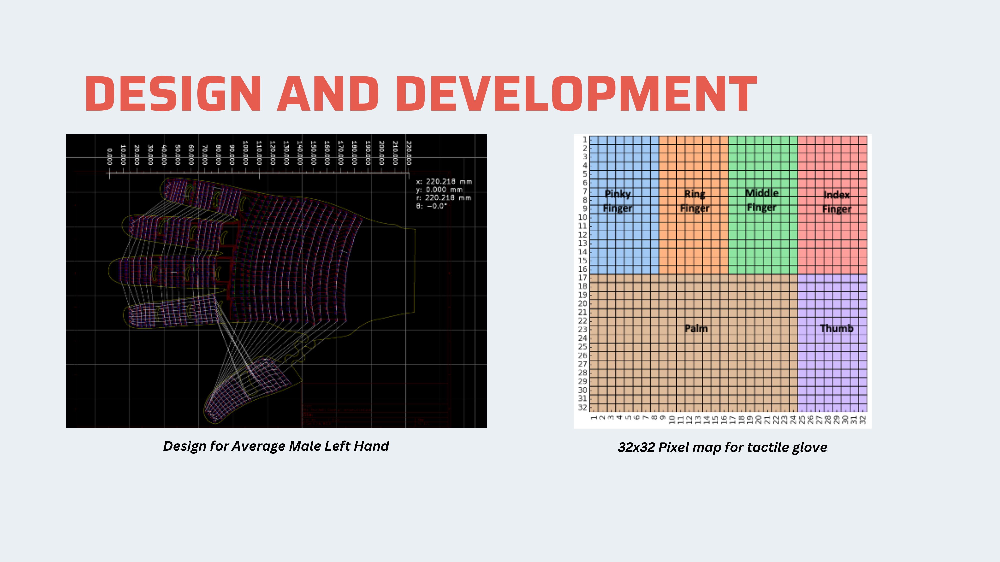

<!-- markdownlint-disable MD041 -->


# HDSense Glove

A high-density 32×32 pressure-sensing glove for prosthetics and haptic feedback

*Johns Hopkins University · Advanced Instruments and Systems · Fall 2024*
*Advised by Dr. Nitish Thakor and Arik Slepyan · Neuroengineering and Biomedical Instrumentation Lab*

---

## Overview

The HDSense Glove maps the full tactile surface of a hand using a **32×32 TDMA sensor array** - 1,024 individual pressure points per glove - streaming real-time contact data over serial. Designed for prosthetic hands, robotic manipulation, and human-computer interaction.

**Key specs:**

- 1,024 pressure sensors per glove (32×32 grid)
- **1000 Hz** frame rate, **20ms** latency
- **88% accuracy** detecting objects via compressed sensing
- **18× faster** than traditional raster scanning (Slepyan et al., 2024)
- Teensy 4.1 microcontroller, low-power flex-PCB design

---

## PCB Design

The glove uses a custom flex-PCB shaped to the anatomy of an average male hand (220mm length). Copper traces follow natural glove cuts with a flexible thumb extension. 32 row output pins are driven sequentially via TDMA, with a 5-bit MUX selecting across 32 columns - reducing 1,024 connections to a single analog readout channel.



Left: KiCad flex-PCB layout shaped to the left hand geometry | Right: 32×32 sensor pixel map with finger and palm zones

The PCB was designed in KiCad with separate left-hand (LH) and right-hand (RH) variants. KiCad source files: [`hardware/LH/`](hardware/LH/) and [`hardware/RH/`](hardware/RH/)

---

## Firmware

`firmware/tdma_32x32_foot.ino` - compiled for **Teensy 4.1**

Performs a full 32×32 raster scan per loop using TDMA, outputs all 1,024 values as a comma-separated serial stream per frame. Uses `FASTRUN` and `digitalWriteFast` for maximum scan speed.

```cpp
for (int i = 0; i < 32; i++) {       // activate row
  for (int j = 0; j < 32; j++) {     // step through mux columns
    values[idx++] = analogRead(A0);  // read pressure
  }
}
```

---

## Project Poster


Full project poster - includes KiCad PCB rendering (Fig. 3) and MATLAB sensor heatmap visualization (Fig. 4)

---

## Docs

| Document | Description |
| -------- | ----------- |
| [Final Pitch Deck](docs/HDSense%20Glove%20Final%20Pitch.pdf) | Product pitch and system overview |
| [Project Poster](docs/Harish_Poster_Final.pdf) | Full project summary poster |

---

Harish Balasubramanian · Johns Hopkins University
